# AIDE Mobile Application

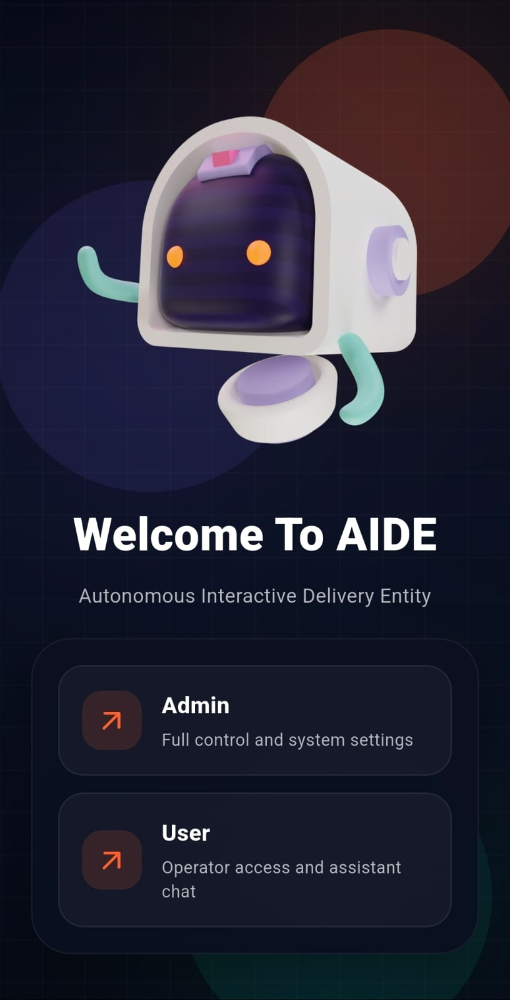

## Overview

**AIDE** stands for **Autonomous Interactive Delivery Entity**. It is a Flutter-based mobile application developed to control, monitor, and interact with the AIDE indoor robotic assistant. The app works as the main user interface for the robot, allowing authorized users to connect to the robot backend, view telemetry, control movement, start or stop person-following, use localization tools, communicate with an AI chatbot, and trigger emergency stop when needed.

AIDE is a complete hardware-software robotic prototype. The mobile app is not just a UI layer; it is part of a larger system that includes a Jetson-based robot backend, Kinect RGB-D camera input, YOLO-based person detection, Firebase account handling, Flask API communication, localization support, safety handling, and AI-based interaction.

## Figma Design

The complete UI/UX design of the AIDE mobile application is available here:

[View AIDE Figma Design](https://www.figma.com/design/SjaOdXxQCbZyO64JFcqYHt/AIDE?node-id=0-1&p=f&t=skCJSdIrRTxq1yBE-0)

---

## App Preview

| Welcome / Role Selection | Admin Setup | Admin Login |
|---|---|---|
|  | 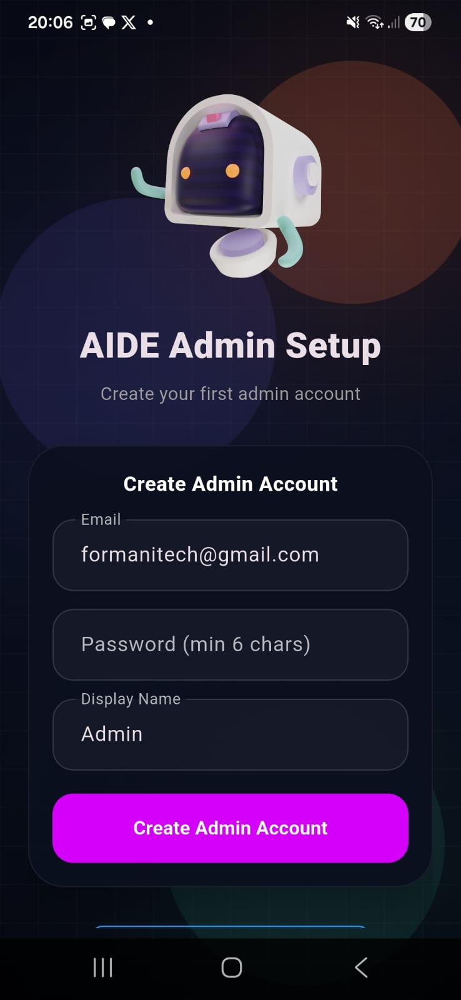 | 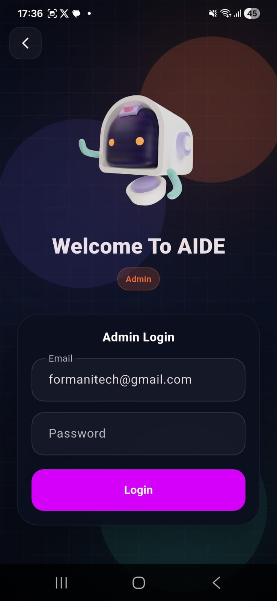 |

| Dashboard | Manual Drive | Person Following |
|---|---|---|
| 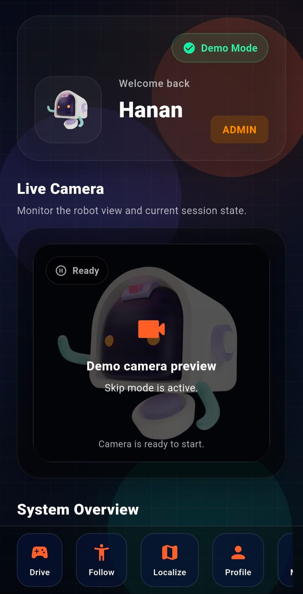 | 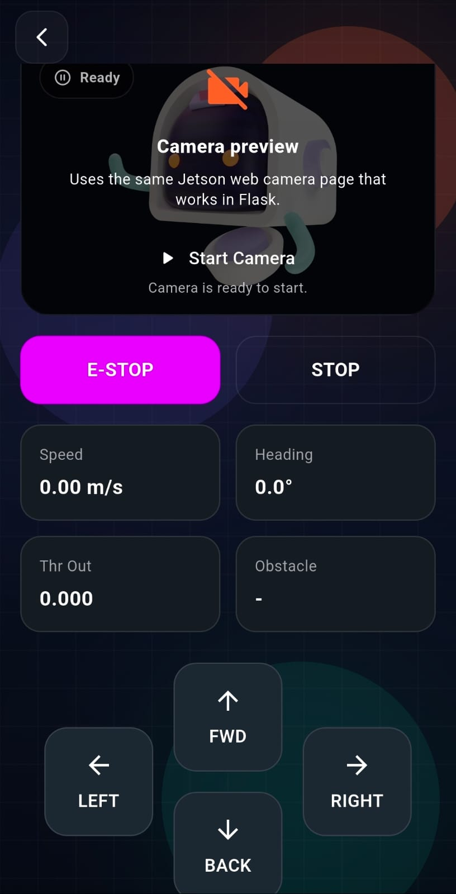 | 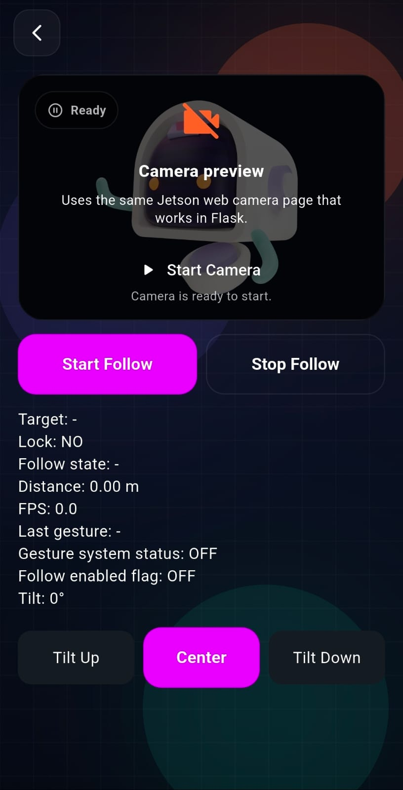 |

| Localization | Chat AI | User Management |
|---|---|---|
| 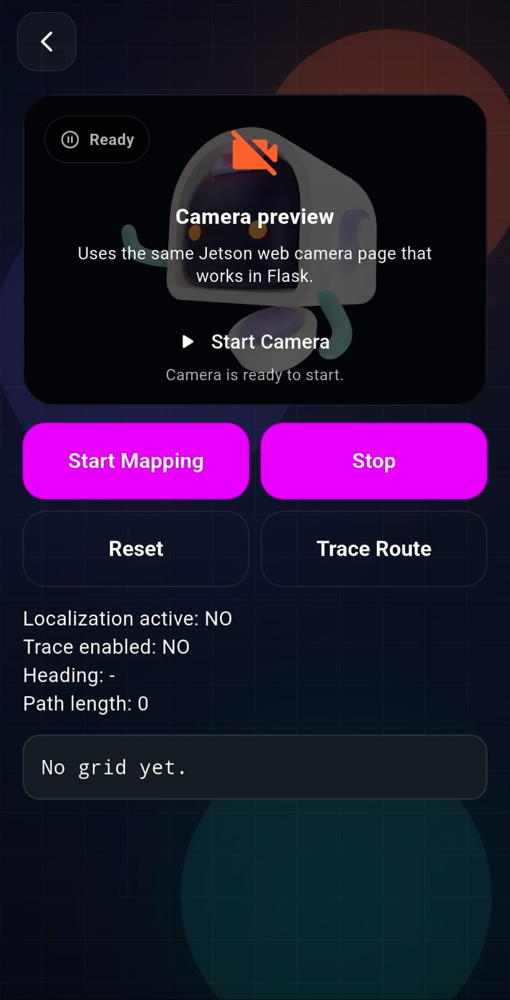 | 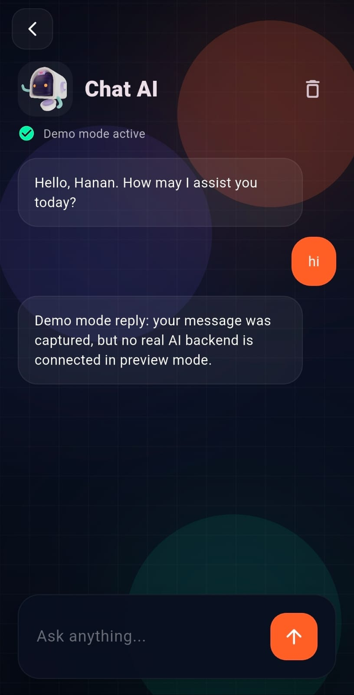 | 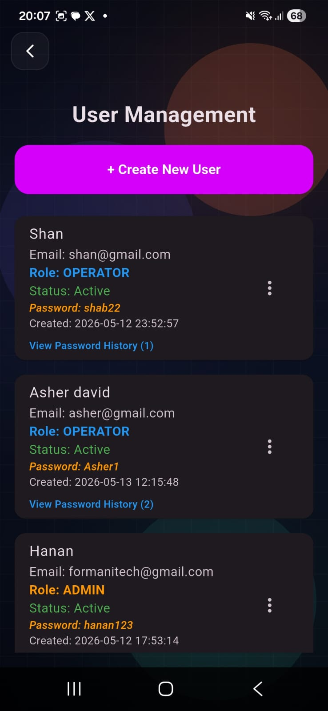 |

| Connect Screen | Profile | Dashboard Target Control |
|---|---|---|
| 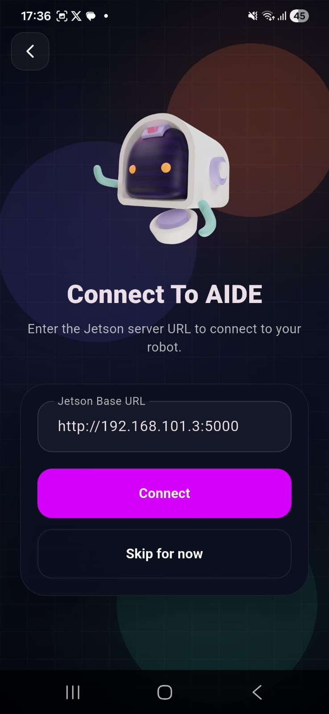 | 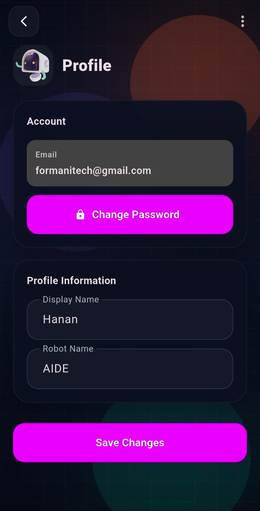 | 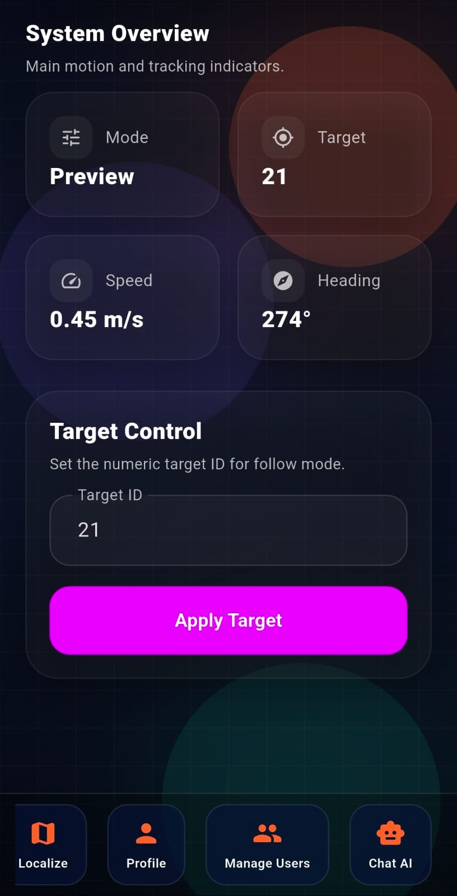 |

---

## Key Features

### First-Time Admin Setup

When the app is opened for the first time and no Admin account exists, it displays the **AIDE Admin Setup** screen. The first Admin account is created using email, password, and display name. After this initial setup, the app moves to the normal Admin/User login flow on future launches.

### Role-Based Login

AIDE supports two primary roles:

| Role | Access Level |
|---|---|
| **Admin** | Complete access to app and system functions |
| **Operator/User** | Operational access with restricted administrative permissions |

The Admin can manage users, configure restricted settings, use localization, monitor telemetry, control the robot, access chatbot, and trigger emergency stop. The Operator can use the robot during normal operation, including dashboard monitoring, manual drive, person-following, camera tilt, chatbot, allowed localization playback/use, and emergency stop.

### Admin User Management

The Admin can create, view, edit, activate/deactivate, and delete Operator accounts through the User Management screen. Operator users cannot access this feature.

### Robot Server Connection

The app connects to the robot-side Flask backend using the Jetson server URL.

Example:

```text
http://192.168.1.8:5000
```

After connection, the app can request telemetry, camera status, movement state, localization state, chatbot responses, and safety status from the backend.

### Dashboard and Telemetry

The Dashboard gives a real-time overview of the robot. It displays values such as:

- Robot mode
- Target ID
- Speed
- Heading
- FPS
- Follow state
- Lock state
- Emergency stop state
- Throttle output
- Steering value
- Obstacle state
- Gesture status
- Camera status

The dashboard also includes target control for setting a numeric target ID used in person-following mode.

### Live Camera Preview

The app includes a camera preview/status section. If the camera stream is available, the app can display the robot camera feed or camera-ready status. If the stream is unavailable, the app shows a fallback state instead of crashing.

### Manual Drive

The Manual Drive screen allows direct robot movement control through the mobile app.

Available controls include:

- Forward
- Backward
- Left
- Right
- Stop
- Emergency Stop

Manual drive commands are sent to the robot backend, which forwards them to the robot control module after safety checks.

### Person-Following Mode

The Person Following screen allows the user to start or stop autonomous follow behavior. The robot uses camera-based detection and tracking to follow the selected target person while maintaining safe behavior.

The screen displays:

- Target ID
- Lock status
- Follow state
- Distance
- FPS
- Last gesture
- Gesture system status
- Follow enabled state
- Kinect tilt angle

### Camera Tilt Control

The app supports camera tilt controls for adjusting the Kinect/camera angle:

- Tilt Up
- Center
- Tilt Down

This helps improve target visibility during person-following, camera monitoring, and gesture interaction.

### Localization and Mapping

The Localization screen supports route/path-related functions:

- Start Mapping
- Stop
- Reset
- Trace Route

The screen displays localization state, trace state, heading, path length, and grid/map output. Admin has full localization access, while Operator can use/play allowed localization functions but cannot configure restricted localization settings.

### AI Chatbot

The Chat AI screen allows Admin and Operator users to communicate with the robot-side AI chatbot. Users can send messages and receive responses through the backend AI route. The chatbot is intended for interaction, explanation, and assistance, but safety-critical robot movement should still rely on direct controls and safety logic.

### Emergency Stop

Emergency Stop is a critical safety feature. The E-STOP button sends an emergency stop command to the robot backend and is intended to override normal movement commands, placing the robot in a safe stopped state.

---

## System Architecture

AIDE follows a client-server robotic architecture.

```text
Flutter Mobile App
        |
        | HTTP Requests
        v
Flask Backend Server on Jetson
        |
        | Robot commands, telemetry, camera, AI, localization
        v
Robot Control, Perception, Localization, AI, and Safety Modules
        |
        v
Robot Hardware
```

### Main Components

| Component | Description |
|---|---|
| Flutter Mobile App | Main UI for Admin and Operator users |
| Firebase Authentication | Handles login and account authentication |
| Cloud Firestore | Stores user profiles, roles, and account information |
| SharedPreferences | Stores local settings such as theme and Jetson URL |
| Flask Backend | Robot-side API server running on Jetson |
| Jetson Orin Nano | Main onboard processing platform |
| Kinect RGB-D Camera | Provides RGB and depth input |
| YOLO-based Detection | Detects and tracks people for person-following |
| Robot Control Module | Handles throttle, steering, mode switching, and movement |
| Localization Module | Handles mapping, route trace, reset, and path state |
| AI Chat Module | Handles chatbot messages and responses |
| Safety Module | Handles stop, emergency stop, target loss, and obstacle state |

---

## Technology Stack

### Mobile Application

- Flutter
- Dart
- Firebase Core
- Firebase Authentication
- Cloud Firestore
- HTTP package
- SharedPreferences
- WebView Flutter
- Material UI

### Robot Backend

- Python
- Flask
- OpenCV
- YOLOv8
- TensorRT
- EasyOCR
- libfreenect
- aiortc / camera streaming support
- PySerial
- smbus / smbus2

### Robot Hardware

- NVIDIA Jetson Orin Nano
- Kinect RGB-D Camera
- PCA9685 PWM driver
- Ultrasonic sensors
- Motor driver / ESC
- Steering servo
- HMC5883L compass
- Battery and power regulation system
- Local Wi-Fi router/network

---

## Folder Structure

```text
lib/
│
├── firebase_options.dart
├── main.dart
│
├── models/
│   └── app_role.dart
│
├── screens/
│   ├── about_screen.dart
│   ├── admin_setup_screen.dart
│   ├── admin_user_management_screen.dart
│   ├── ai_chat_screen.dart
│   ├── connect_screen.dart
│   ├── dashboard_screen.dart
│   ├── forgot_password_screen.dart
│   ├── help_support_screen.dart
│   ├── localization_screen.dart
│   ├── login_screen.dart
│   ├── manual_drive_screen.dart
│   ├── opening_screen.dart
│   ├── password_change_screen.dart
│   ├── person_follow_screen.dart
│   ├── privacy_policy_screen.dart
│   ├── profile_screen.dart
│   ├── register_screen.dart
│   ├── role_welcome_screen.dart
│   └── settings_screen.dart
│
├── services/
│   ├── admin_setup_service.dart
│   ├── app_storage.dart
│   ├── firebase_auth_service.dart
│   ├── firestore_user_service.dart
│   └── robot_api.dart
│
├── theme/
│   └── app_theme.dart
│
└── widgets/
    ├── aide_panel.dart
    ├── aide_shell.dart
    ├── aide_text_field.dart
    ├── hold_button.dart
    └── robot_live_feed.dart
```

---

## Backend API Routes Used by the App

| Endpoint | Method | Purpose |
|---|---|---|
| `/telemetry` | GET | Fetch robot telemetry |
| `/health` | GET | Check backend health |
| `/status` | GET | Check backend status |
| `/cmd` | POST | Send manual throttle/steering command |
| `/mode` | POST | Switch robot mode |
| `/estop` | POST | Trigger emergency stop |
| `/config` | POST | Set target ID or configuration values |
| `/loc/start` | POST | Start localization/mapping |
| `/loc/stop` | POST | Stop localization/mapping |
| `/loc/reset` | POST | Reset localization map/path |
| `/loc/state` | GET | Fetch localization state and grid |
| `/loc/trace` | POST | Start/stop route tracing |
| `/kinect_tilt_hold` | POST | Hold camera tilt up/down/stop |
| `/kinect_tilt` | POST | Center camera tilt |
| `/ai/send` | POST | Send chatbot message |
| `/ai/clear` | POST | Clear chatbot memory |
| `/ai/health` | GET | Check AI chatbot backend health |

---

## Firebase Data

The app uses Firebase for authentication and app-side account storage.

### Firebase Services

- Firebase Authentication
- Cloud Firestore

### Firestore Collection

```text
users
```

### User Profile Fields

```text
uid
email
displayName
photoURL
password
role
isActive
passwordHistory
createdAt
updatedAt
```

### Supported Roles

```text
admin
operator
```

> Security note: This is an academic prototype. For production use, passwords should not be stored in readable Firestore fields. Authentication should rely on Firebase Authentication and properly configured Firestore security rules.

---

## Installation and Setup

### 1. Clone the Repository

```bash
git clone https://github.com/your-username/your-repository-name.git
cd your-repository-name
```

### 2. Install Flutter Dependencies

```bash
flutter pub get
```

### 3. Configure Firebase

1. Create a Firebase project.
2. Enable Firebase Authentication.
3. Enable Email/Password sign-in.
4. Enable Cloud Firestore.
5. Add your Android app to Firebase.
6. Download and place the required Firebase configuration files.
7. Generate `firebase_options.dart` using FlutterFire CLI.

```bash
flutterfire configure
```

### 4. Run the App

```bash
flutter run
```

For Chrome testing:

```bash
flutter run -d chrome
```

> Note: Flutter Web may face browser CORS restrictions when calling the Jetson Flask backend. Android device testing is recommended for real robot operation unless CORS is configured properly on the backend.

### 5. Build APK

```bash
flutter build apk
```

The APK will be generated in:

```text
build/app/outputs/flutter-apk/
```

---

## Robot Backend Startup

The robot backend should run on the Jetson or robot-side Linux system.

```bash
cd ~/Desktop/AIDE
source ../follownum/bin/activate
python3 main.py
```

After the backend starts, copy the displayed Jetson IP address and enter it in the mobile app Connect screen.

Example:

```text
http://192.168.x.x:5000
```

---

## Basic App Workflow

```text
Open App
   |
   v
First-Time Admin Setup, if no Admin exists
   |
   v
Choose Admin or User
   |
   v
Login
   |
   v
Connect to Jetson Backend
   |
   v
Dashboard
   |
   +--> Manual Drive
   +--> Person Following
   +--> Localization
   +--> Chat AI
   +--> Profile
   +--> User Management, Admin only
```

---

## User Roles and Permissions

| Feature | Admin | Operator/User |
|---|---:|---:|
| Login | Yes | Yes |
| Connect to Robot | Yes | Yes |
| Dashboard Telemetry | Yes | Yes |
| Camera Status / Preview | Yes | Yes |
| Manual Drive | Yes | Yes |
| Person Following | Yes | Yes |
| Camera Tilt | Yes | Yes |
| Localization Use / Playback | Yes | Yes |
| Full Localization Configuration | Yes | No |
| User Management | Yes | No |
| Profile | Yes | Limited |
| Chat AI | Yes | Yes |
| Emergency Stop | Yes | Yes |

---

## Screenshots Folder Setup

For the screenshot section to display correctly on GitHub, keep the images in this folder:

```text
docs/screenshots/
```

Recommended screenshot names:

```text
docs/screenshots/welcome_screen.jpeg
docs/screenshots/role_selection.jpeg
docs/screenshots/admin_setup.jpeg
docs/screenshots/admin_login.jpeg
docs/screenshots/connect_screen.jpeg
docs/screenshots/dashboard_main.jpeg
docs/screenshots/dashboard_live_camera.jpeg
docs/screenshots/dashboard_target_control.jpeg
docs/screenshots/manual_drive.jpeg
docs/screenshots/person_following.jpeg
docs/screenshots/localization.jpeg
docs/screenshots/chat_ai.jpeg
docs/screenshots/user_management.jpeg
docs/screenshots/user_management_records.jpeg
docs/screenshots/profile.jpeg
```

---

## Safety Notes

AIDE controls a physical robot. Always test it carefully.

- Operate only in a controlled indoor environment.
- Keep the robot away from stairs, glass, water, and crowded areas.
- Start movement testing at low speed.
- Keep Emergency Stop accessible at all times.
- Do not start person-following unless the target is clearly visible.
- Do not allow the robot to continue moving if the target is lost.
- Check wiring, battery, sensors, and motor hardware before testing.
- Do not expose the Flask backend publicly without authentication and security controls.

---

## Troubleshooting

| Problem | Possible Fix |
|---|---|
| App cannot connect to robot | Check Jetson IP, backend URL, port 5000, Wi-Fi network, and Flask server |
| Telemetry not updating | Check `/telemetry` endpoint, backend logs, and network connection |
| Camera preview unavailable | Check Kinect USB, camera backend route, libfreenect, and permissions |
| Flutter Web cannot connect | Enable CORS on backend or use Android APK/device testing |
| Manual drive not working | Check `/cmd` route, motor driver, battery, PCA9685, and E-STOP state |
| Person-following does not lock | Check target ID, camera view, lighting, YOLO model, and target visibility |
| Localization grid not showing | Check `/loc/state`, mapping state, heading data, and backend localization module |
| Chatbot does not respond | Check `/ai/health`, local AI server, and backend AI route |
| Firebase login failing | Check Firebase config, internet connection, Firebase Auth, and Firestore rules |
| App theme not updating | Restart app or check SharedPreferences/theme settings |

---

## Testing Summary

The application was tested for:

- First-time Admin setup
- Admin and Operator login
- User management
- Robot server connection
- Dashboard telemetry
- Camera status fallback
- Manual drive commands
- Stop and Emergency Stop
- Person-following start/stop
- Camera tilt controls
- Localization mapping and route tracing
- Chatbot messaging
- Offline backend handling
- Firebase account handling
- Gesture-related status display
- Complete app and robot integration

---

## Current Status

The AIDE mobile app is a working academic prototype. It demonstrates role-based access, Firebase account management, robot backend connection, telemetry display, manual control, person-following control, localization interface, chatbot interaction, camera status handling, and emergency stop support.

---

## Future Improvements

- More stable live video streaming in Flutter
- Stronger obstacle avoidance
- Improved SLAM/localization support
- Battery monitoring in the app
- Voice command support
- Improved AI assistant integration
- Secure remote dashboard access
- Better Firebase security rules
- More detailed diagnostic logs
- Push notifications for robot alerts
- Improved map visualization
- Better target re-identification for person-following

---

## Team

**Project Title:** AIDE - Autonomous Interactive Delivery Entity  
**Department:** Computer Science  
**Institute:** Forman Christian College (A Chartered University)

### Team Members

- Abdul Hanan Asif
- Sheikh Shan Elahi
- Mobeen Azam Mazari
- Ghulam Hassan

---

## Disclaimer

AIDE is an academic prototype developed for educational and demonstration purposes. It is not a certified commercial robotic product. The robot should be operated only in controlled indoor environments under supervision.

---

## License

This repository is intended for academic project use. Add the preferred license for the repository before making it public.
